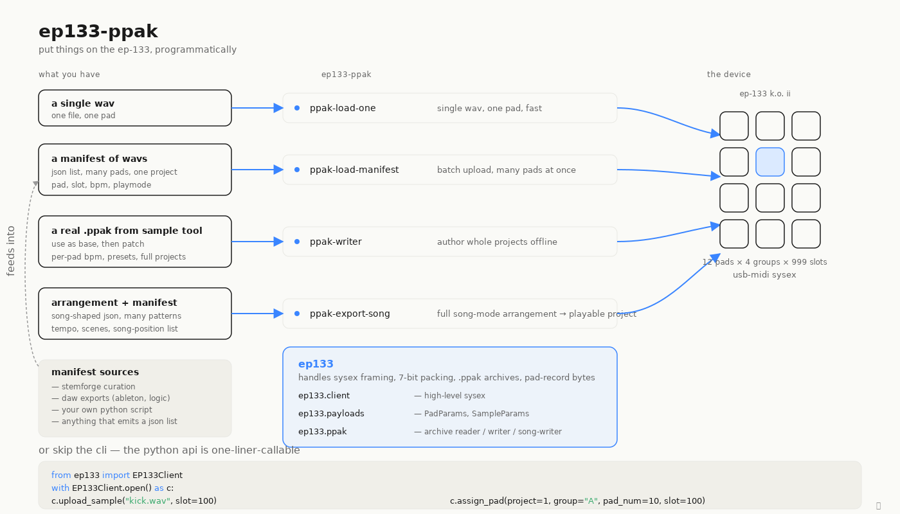

# ep133-ppak

```
            _ __________                         _    
  ___ _ __ / |___ /___ /       _ __  _ __   __ _| | __
 / _ \ '_ \| | |_ \ |_ \ ____| '_ \| '_ \ / _` | |/ /
|  __/ |_) | |___) |__) |____| |_) | |_) | (_| |   < 
 \___| .__/|_|____/____/     | .__/| .__/ \__,_|_|\_\
     |_|                     |_|   |_|               
```

Reverse-engineered SysEx + `.ppak` protocol library for the
[Teenage Engineering EP-133 K.O. II](https://teenage.engineering/products/ep-133).



Write valid `.ppak` archives from Python — both sample-mode pads and
full **song-mode** projects with multiple patterns, scenes, and a
song-position playlist. Decode the EP-133's binary pad record. Read
project files live via SysEx. Upload samples and assign pads without
touching Sample Tool.

## What this gives you

### Sample-mode (load samples + pads)

- **A `.ppak` writer that loads cleanly into Sample Tool.** Patches a
  real Sample Tool backup as a base and modifies only the bytes that
  need to change — guarantees format conformance. See
  [`ep133/ppak/writer.py`](ep133/ppak/writer.py).
- **Sample Tool emit format documented end-to-end** — `meta.json`
  schema, ZIP entry conventions, the absent-on-purpose `settings` file
  (a footgun: adding one triggers ERROR CLOCK 43 and a flash-format
  recovery), and WAV requirements (44.1 kHz stereo for `.ppak`; the
  device transcodes to 46875 mono internally).
- **The diff method** — a reproducible procedure for verifying
  pad-record byte offsets via two Sample Tool backups, before and after
  one UI change. Anyone with the device can confirm or extend the byte
  layout in this repo. See
  [docs/verifying-byte-offsets.md](docs/verifying-byte-offsets.md).
- **Diff-verified pad-record byte layout** — the 26-byte record
  (factory native; PROTOCOL.md §7.0 covers the erratum vs older
  published tables) gets a field-by-field verification status. Offsets
  that came out a bit different from earlier tables are flagged so
  future work can reconcile them. See
  [PROTOCOL.md §7](PROTOCOL.md#7-pad-binary-record).
- **Two pad-numbering conventions, called out** — the TAR's `pNN`
  counts bottom-up; the SysEx `pad_num` counts top-down. Same physical
  pad, different numbers. Easy to conflate; harder once you've seen the
  diagram.
- **Time-stretch math** for `time.mode=bpm` with the practical
  implication: set each loop's `sound.bpm` to its true recorded tempo,
  and the device's bar inference works cleanly at any project tempo.

### Song-mode (full projects from arrangements)

- **`ppak-export-song`** — turns an `arrangement.json` plus a
  `manifest.json` into a song-mode `.ppak` the device boots straight
  into: multiple patterns, multiple scenes, and a song-position
  playlist that plays without touching the front panel. See
  [docs/diagrams/04_song_pipeline.md](docs/diagrams/04_song_pipeline.md).
- **A three-stage pipeline** under `ep133/song/`. `resolve_scenes()`
  walks the arrangement's locators and picks which clip is active on
  each track; `synthesize()` dedupes patterns by `(group, pad, bars)`
  and encodes EP-133 limits (99 scenes, 99 patterns/group, 12 pads/
  group) into a `PpakSpec`; `build_ppak()` authors fresh patterns /
  scenes / sounds while patching a reference template's `meta.json`
  and per-pad byte templates. `build_synthetic_template_ppak()` covers
  the no-capture case.
- **Stem-export pipeline integration.** The arrangement / manifest
  shapes are the integration surface for tools like
  [StemForge](https://github.com/zacharysbrown/stemforge), whose
  Ableton Live arrangement-export flow is the original consumer of
  `ppak-export-song`.

## Building on prior work

This project stands on a chain of community reverse-engineering:

- [**phones24**](https://github.com/phones24) — the original `.ppak`
  archive parser. Their work is the reason any of this was tractable;
  their RE bootstrapped the broad protocol shape, including the
  pad-record fields.
- [**ep133-krate**](https://github.com/icherniukh/ep133-krate) — extensive
  live SysEx capture-based protocol RE + a polished sample-manager TUI.
  Complementary surface area to this project: krate covers the live
  SysEx path with capture-backed depth; this repo covers the on-disk
  `.ppak` archive format and the in-TAR binary pad record.
- [**garrettjwilke/ep_133_sysex_thingy**](https://github.com/garrettjwilke/ep_133_sysex_thingy),
  [**benjaminr/mcp-koii**](https://github.com/benjaminr/mcp-koii), and
  **abrilstudios/rcy** — earlier or adjacent community efforts cited by
  the projects above.

[ACKNOWLEDGMENTS.md](ACKNOWLEDGMENTS.md) has the full breakdown of what
each project contributed and where to use their work today.

## Install

```bash
pip install -e .
# or with MIDI backends for live device interaction:
pip install -e ".[midi]"
```

Requires Python 3.11+. Live USB-MIDI requires `mido` + `python-rtmidi`.

## Quick start

Three flows, in order of complexity.

### a. Single sample on a single pad

One WAV, one pad. Requires the `[midi]` extra (live device I/O). See
[`tools/load_one.py`](tools/load_one.py).

```bash
# Drop kick.wav onto Project 1, Group A, pad "7" (top-left), slot 100
ppak-load-one kick.wav --project 1 --group A --pad 7 --slot 100

# Tag a loop with its true BPM so time.mode=bpm stretches it cleanly
# at any project tempo, and target pad "." (bottom-left)
ppak-load-one loop.wav \
    --project 9 --group C --pad . --slot 220 \
    --bpm 107.666
```

`--bpm` writes `sound.bpm` and sets `time.mode=bpm` on the slot. Pad
labels follow the physical keypad: `7 8 9 / 4 5 6 / 1 2 3 / . 0 ENTER`.

### b. Bulk-load samples from a manifest

Many WAVs in one pass, BPM and group routing baked in. See
[`tools/load_from_manifest.py`](tools/load_from_manifest.py) for the
full schema (the `BatchManifest` form below is preferred; a legacy
stems-grouped form is also accepted).

```jsonc
// manifest.json
{
  "version": 1,
  "track": "imagine_dragons_demo",
  "bpm": 107.666,
  "samples": [
    {"file": "drums_001.wav", "stem": "drums",  "suggested_group": "A", "suggested_pad": "7"},
    {"file": "bass_001.wav",  "stem": "bass",   "suggested_group": "B", "suggested_pad": "7"},
    {"file": "vox_chorus.wav","stem": "vocals", "suggested_group": "C", "playmode": "oneshot"}
  ]
}
```

```bash
ppak-load-manifest manifest.json \
    --project 9 \
    --groups A=drums B=bass C=vocals D=other \
    --start-slot 300
```

The batch-level `bpm` is written to every slot's `sound.bpm` (per-sample
`bpm` overrides). `suggested_group` / `suggested_pad` claim specific
placements; samples without them fill remaining bar-indices in order.

### c. Build a full song-mode .ppak from an arrangement

Inputs: an `arrangement.json` (locators + clip placements) and a
`manifest.json` (WAVs + slot metadata). Output: a song-mode `.ppak`
with multiple patterns, scenes, and a song-position playlist. See
[`docs/MANIFEST.md`](docs/MANIFEST.md) for both schemas.

```bash
# Synthesize a minimal device-default template (no capture needed)
ppak-export-song \
    --arrangement snapshot.json \
    --manifest stems.json \
    --out song.ppak

# Use a captured reference .ppak for byte-accurate per-pad metadata
ppak-export-song \
    --arrangement snapshot.json \
    --manifest stems.json \
    --reference-template tests/fixtures/reference.ppak \
    --project 3 \
    --out out/song.ppak
```

Pull a reference template off your own device with
[`tools/ep133_capture_reference.py`](tools/ep133_capture_reference.py).

### Driving the device live (no Chrome)

Want to drive the device live without Chrome? See
[`docs/LOADING_SAMPLES.md`](docs/LOADING_SAMPLES.md) for the
`EP133Client` Python API.

## Repository layout

```
ep133/                       The Python library
  __init__.py                Lazy-loaded EP133Client
  client.py                  High-level SysEx client
  transport.py               MIDI port discovery + I/O
  sysex.py                   Frame build/parse, request IDs
  packing.py                 7-bit packing
  commands.py                Command bytes, sub-cmd bytes, fileId formula
  payloads.py                PadParams, SampleParams, payload builders
  audio.py                   WAV → 46875 Hz mono PCM transcode
  transfer.py                Upload message-sequence generator
  project_reader.py          Live read project TAR via SysEx
  pad_record.py              Decode 26-byte pad records
  manifest.py                SampleMeta + BatchManifest schemas
  ppak/
    writer.py                .ppak archive writer (patch-from-base)
    song_writer.py           Build-from-spec writer (song-mode)
  song/
    format.py                Byte builders: patterns, scenes, pads, settings
    resolver.py              arrangement → scene snapshots
    synthesizer.py           snapshots → PpakSpec
    wav.py                   EP-133-native WAV conversion

tools/                       CLI utilities (5 entry points)
  ppak_writer.py             ppak-writer         — patch a base .ppak with a preset
  load_one.py                ppak-load-one       — single sample on a single pad
  load_from_manifest.py      ppak-load-manifest  — bulk-load from JSON
  bpm_matrix.py              ppak-bpm-matrix     — 12-pad BPM matrix via SysEx
  export_song.py             ppak-export-song    — arrangement → song-mode .ppak
  ep133_capture_reference.py Pull a project TAR off live hardware

tests/                       pytest suite (319+ tests, all passing)

docs/
  diagrams/                  Illustrated docs (8 SVGs + companion .md)
  validation-guide.md        What to expect when validating a generated .ppak
  verifying-byte-offsets.md  The diff method for verifying pad-record bytes
  PORT_PLAN.md               Architectural notes for the song-mode port

PROTOCOL.md                  Complete protocol + format specification
LICENSE                      MIT
```

## See also

- **[PROTOCOL.md](PROTOCOL.md)** — full SysEx + `.ppak` format reference
- **[docs/diagrams/00_overview.md](docs/diagrams/00_overview.md)** — illustrated tour of the whole pipeline
- **[docs/diagrams/04_song_pipeline.md](docs/diagrams/04_song_pipeline.md)** — song-mode pipeline narrative
- **[ACKNOWLEDGMENTS.md](ACKNOWLEDGMENTS.md)** — what each upstream project contributed and where their work shines today

## Status

This is community RE; expect errors. Verify against real device output
before using for anything load-bearing. PRs and corrections welcome.

Tested against firmware **OS 2.0.5** as of 2026-04. Sample-mode flows
are hardware-validated. Song-mode export is new: the source code is
hardware-validated through StemForge (where it originated), but
end-to-end validation of the packaged version in this repo is still
pending — see [CHANGELOG.md](CHANGELOG.md#pending-validation) for the
open items.

## License

MIT — see [LICENSE](LICENSE).
