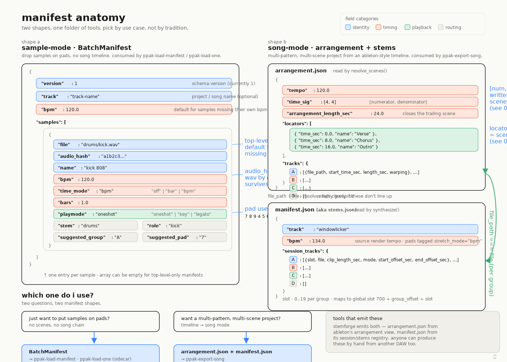

# Manifest formats

`ep133-ppak` reads two distinct manifest shapes, and which one you produce
depends on what you're trying to build:

- **`BatchManifest`** (sample-mode) — a flat list of WAVs with per-pad routing
  hints. Use this when you want to drop a folder of samples onto the EP-133's
  pads. Consumed by `ppak-load-manifest` and (via sidecar) `ppak-load-one`.
- **`arrangement.json` + `manifest.json`** (song-mode) — a pair of files that
  together describe an Ableton-style timeline of clips on tracks A/B/C/D plus
  the session-view source stems those clips reference. Consumed by
  `ppak-export-song` to build a full song-mode `.ppak`.

Pick by use case. If your goal is "load these samples onto pads," use
`BatchManifest`. If your goal is "build a multi-pattern, multi-scene project
from a timeline," use the arrangement+stems pair.



---

## Shape A — `BatchManifest` (sample-mode)

The canonical pydantic schema lives in [`ep133/manifest.py`](../ep133/manifest.py).
A `BatchManifest` is the contents of a `.manifest.json` file dropped in the
same directory as your WAVs (or supplied explicitly via `--manifest`). Each
entry inside the `samples` array is a `SampleMeta`.

### Top-level fields

| Field      | Type             | Required | What it does                                            |
| ---------- | ---------------- | -------- | ------------------------------------------------------- |
| `version`  | `int`            | no (=1)  | Schema version. Currently `1`.                          |
| `track`    | `str` \| null    | no       | Project / song name. Informational only.                |
| `bpm`      | `float` \| null  | no       | Default bpm for samples that don't carry their own.     |
| `samples`  | `list[SampleMeta]` | no     | Per-sample entries; can be empty.                       |

### Per-sample fields (`SampleMeta`)

| Field             | Type                                      | Required | What it does                                                                              |
| ----------------- | ----------------------------------------- | -------- | ----------------------------------------------------------------------------------------- |
| `file`            | `str` \| null                             | no       | Filename (relative to manifest dir) used for filename-fallback matching.                  |
| `audio_hash`      | `str` (16 hex chars) \| null              | no       | First 16 hex chars of `sha256(wav_bytes)`. Survives renames; preferred over filename.     |
| `name`            | `str` \| null                             | no       | Human-friendly label written into the device's pad metadata.                              |
| `bpm`             | `float` \| null                           | no       | Source render tempo for this sample.                                                      |
| `time_mode`       | `"off"` \| `"bar"` \| `"bpm"` \| null     | no       | Time-stretch mode the EP-133 should use.                                                  |
| `bars`            | `float` \| null                           | no       | Length-in-bars for `time_mode="bar"`/`"bpm"`.                                             |
| `playmode`        | `"oneshot"` \| `"key"` \| `"legato"` \| null | no    | Pad's gate behavior on the device.                                                        |
| `stem`            | `"drums"` \| `"bass"` \| `"vocals"` \| `"other"` \| `"full"` \| null | no | Stem category. Routing hint.                                  |
| `source_track`    | `str` \| null                             | no       | Originating session track name. Informational.                                            |
| `role`            | `str` \| null                             | no       | Free-form role tag (`"kick"`, `"snare"`, `"lead"`, ...). Informational.                   |
| `suggested_group` | `"A"` \| `"B"` \| `"C"` \| `"D"` \| null  | no       | Hint to the loader to drop this sample on a particular group.                             |
| `suggested_pad`   | `"7"` \| `"8"` \| `"9"` \| `"4"` \| `"5"` \| `"6"` \| `"1"` \| `"2"` \| `"3"` \| `"."` \| `"0"` \| `"ENTER"` \| null | no | Hint at a specific pad. Uses **keypad labels**, not a 1..12 index. |

### `suggested_pad` uses keypad labels

The 12 pads on the EP-133 are arranged like a phone keypad. The labels run
top-to-bottom:

```
7  8  9
4  5  6
1  2  3
.  0  ENTER
```

A `suggested_pad` of `"7"` means the upper-left pad, not pad index 7. This
matches what's printed on the device.

### Resolution order

When a CLI tool needs metadata for a single WAV (e.g. `ppak-load-one`), it
calls `resolve_meta()` from `ep133.manifest`, which walks this chain:

1. **Explicit override** — a `--manifest` flag pointing at a JSON file. The
   loader sniffs whether it's a sidecar (single object) or a batch (object
   with `samples` list) by content shape.
2. **Sidecar** — a file named `.manifest_<audio_hash>.json` next to the WAV.
   `audio_hash` is the first 16 hex chars of `sha256(wav_bytes)`.
3. **Batch** — a file named `.manifest.json` in the WAV's directory; the
   matching entry is found by `audio_hash` (preferred) and falls back to
   filename match against `SampleMeta.file`.
4. **None** — `resolve_meta()` returns `None`; the CLI applies its own
   defaults.

The first match wins. CLI flags layer on top of whatever this returns.

### Sidecar discovery

Sidecars use a content-addressed name so they survive renames and copies:

```
my-sample.wav
.manifest_a1b2c3d4e5f60718.json
```

The 16-hex-char suffix is `compute_audio_hash(my-sample.wav)`. The hash uses
the first 16 chars of the lowercase hex sha256 of the file's raw bytes
(`HASH_LENGTH = 16`).

### Minimal example

```json
{
  "version": 1,
  "samples": [
    {"file": "kick.wav", "name": "kick"},
    {"file": "snare.wav", "name": "snare"}
  ]
}
```

### Maximal example (one sample with everything set)

```json
{
  "version": 1,
  "track": "afterhours-set-1",
  "bpm": 124.0,
  "samples": [
    {
      "file": "drums/kick.wav",
      "audio_hash": "a1b2c3d4e5f60718",
      "name": "kick 808",
      "bpm": 124.0,
      "time_mode": "bpm",
      "bars": 1.0,
      "playmode": "oneshot",
      "stem": "drums",
      "source_track": "drums-bus",
      "role": "kick",
      "suggested_group": "A",
      "suggested_pad": "7"
    }
  ]
}
```

### `BatchManifest`-level bpm fallback

If a sample's `bpm` is `null` and the batch has a top-level `bpm`, the loader
fills it in via `merge_batch_default_bpm()`. This is the only inheritance
relationship in the schema; everything else is per-sample explicit.

---

## Shape B — `arrangement.json` (song-mode)

`arrangement.json` is the timeline. It says where locators sit, what the
project tempo and time signature are, and which clips are dropped onto each
of tracks A/B/C/D at what times. It's read by
[`resolve_scenes()`](../ep133/song/resolver.py).

### Top-level fields

| Field                     | Type                          | Required | What it does                                                                              |
| ------------------------- | ----------------------------- | -------- | ----------------------------------------------------------------------------------------- |
| `tempo`                   | `float`                       | yes      | Project tempo in bpm.                                                                     |
| `time_sig`                | `[int, int]`                  | yes      | `[numerator, denominator]`. Written into scenes file bytes 5/6.                           |
| `arrangement_length_sec`  | `float`                       | no       | End of the timeline in seconds. Closes the trailing scene.                                |
| `locators`                | `list[Locator]`               | yes      | One entry per scene boundary. **At least one** is required.                               |
| `tracks`                  | `{A, B, C, D: list[Clip]}`    | yes      | Per-group clip arrays. Empty arrays are fine; missing keys are treated as empty.          |

### `Locator`

| Field      | Type    | Required | What it does                                                                  |
| ---------- | ------- | -------- | ----------------------------------------------------------------------------- |
| `time_sec` | `float` | yes      | The locator's position on the timeline, in seconds.                           |
| `name`     | `str`   | no       | Human label (e.g. `"verse"`, `"chorus"`). Informational; not encoded on device. |

**Locator semantics.** Each locator marks the *start* of a scene. The *gap*
between consecutive locators IS that scene's length. The trailing scene closes
against `arrangement_length_sec` (if provided), or against the median gap of
preceding scenes (if not), with a final fallback of 2 bars for single-locator
arrangements. See [`07_locator_to_scene.svg`](diagrams/07_locator_to_scene.svg)
for the gap-quantization details.

### `Clip` (entries inside `tracks.A`, `tracks.B`, etc.)

| Field            | Type    | Required | What it does                                                                                |
| ---------------- | ------- | -------- | ------------------------------------------------------------------------------------------- |
| `file_path`      | `str`   | yes      | Path to the WAV. Must match an entry in `manifest.json`'s `session_tracks[<group>]`.        |
| `start_time_sec` | `float` | yes      | Start time on the arrangement timeline.                                                     |
| `length_sec`     | `float` | yes      | Length of the clip in seconds.                                                              |
| `warping`        | `int`   | no (=1)  | Ableton-style warp flag; informational at this point.                                       |

**Clip selection rule.** When multiple clips on the same track overlap a
locator, the *latest-started* clip wins. This matches Ableton's
arrangement-view playback semantics. The active interval is
`start_time_sec <= t < start_time_sec + length_sec` (strict `<` on the right
edge — a locator at exactly clip-end is *not* inside that clip).

### Example

```json
{
  "tempo": 120.0,
  "time_sig": [4, 4],
  "arrangement_length_sec": 24.0,
  "locators": [
    {"time_sec": 0.0,  "name": "Verse"},
    {"time_sec": 8.0,  "name": "Chorus"},
    {"time_sec": 16.0, "name": "Outro"}
  ],
  "tracks": {
    "A": [
      {"file_path": "/songs/test/A/loop_a1.wav", "start_time_sec": 0.0,  "length_sec": 8.0,  "warping": 1},
      {"file_path": "/songs/test/A/loop_a2.wav", "start_time_sec": 4.0,  "length_sec": 12.0, "warping": 1},
      {"file_path": "/songs/test/A/loop_a3.wav", "start_time_sec": 16.0, "length_sec": 8.0,  "warping": 1}
    ],
    "B": [
      {"file_path": "/songs/test/B/bass_b1.wav", "start_time_sec": 0.0,  "length_sec": 16.0, "warping": 1},
      {"file_path": "/songs/test/B/bass_b2.wav", "start_time_sec": 16.0, "length_sec": 4.0,  "warping": 1}
    ],
    "C": [
      {"file_path": "/songs/test/C/vox_c1.wav",  "start_time_sec": 8.0,  "length_sec": 8.0,  "warping": 1}
    ],
    "D": []
  }
}
```

---

## Shape B — `manifest.json` (song-mode stems)

`manifest.json` (sometimes called `stems.json`) is the per-group session-view
registry. Every clip in `arrangement.json` must reference a `file_path` that
shows up here. It's read by
[`synthesize()`](../ep133/song/synthesizer.py).

### Top-level fields

| Field            | Type                            | Required | What it does                                                                                            |
| ---------------- | ------------------------------- | -------- | ------------------------------------------------------------------------------------------------------- |
| `track`          | `str`                           | no       | Project / song name. Informational.                                                                     |
| `bpm`            | `float`                         | no       | **Source render tempo.** Pads get tagged `stretch_mode="bpm"` with `sound_bpm = manifest.bpm`. Falls back to `project_bpm` if absent. Clamped to `[1.0, 200.0]`. |
| `session_tracks` | `{A, B, C, D: list[StemEntry]}` | yes      | Per-group entries. Empty arrays are fine.                                                               |

### `StemEntry`

| Field              | Type    | Required | What it does                                                                                                            |
| ------------------ | ------- | -------- | ----------------------------------------------------------------------------------------------------------------------- |
| `slot`             | `int`   | yes      | Per-group slot, 0..19. Maps to the global EP-133 sample slot `700 + group_offset + slot` (see "Slot mapping" below).    |
| `file`             | `str`   | yes      | Path to the WAV. Must match the `file_path` of every arrangement clip referencing this entry. (`file_path` also accepted.) |
| `clip_length_sec`  | `float` | yes      | Source-render duration of this stem in seconds. Drives `bars` inference and downstream pattern sizing.                  |
| `mode`             | `str`   | no       | Stretch / playback mode tag (e.g. `"trim"`). Informational at this layer.                                               |
| `start_offset_sec` | `float` | no       | Sub-region start, for slot-slicing. The writer slices the WAV from `start_offset_sec` before upload.                    |
| `end_offset_sec`   | `float` | no       | Sub-region end. See "Offset semantics" below.                                                                           |

### Offset semantics

The writer needs a `(start, end)` pair to slice each WAV into the sub-region
the song actually uses. The synthesizer derives this carefully:

- If both `start_offset_sec` and `clip_length_sec` are present, the writer
  uses `(start_offset_sec, start_offset_sec + clip_length_sec)`.
- Otherwise, if `start_offset_sec` and `end_offset_sec` are both present, it
  uses `(start_offset_sec, end_offset_sec)`.

The first form is preferred because some manifests in the wild have an
`end_offset_sec` that doesn't agree with `start_offset_sec + clip_length_sec`.
Trusting `clip_length_sec` (the value the synthesizer used to size the
pattern) keeps audio duration in lock-step with bar count.

### Slot mapping

Each group has a 20-slot window starting at slot 700:

| Group | Per-group slots | Global slot range |
| ----- | --------------- | ----------------- |
| A     | 0..19           | 700..719          |
| B     | 0..19           | 720..739          |
| C     | 0..19           | 740..759          |
| D     | 0..19           | 760..779          |

A `StemEntry` with `slot=0` on group `B` lands at global slot `720`. The 700+
range is reserved by convention so song-export writes don't clobber a user's
1..699 sample library. The mapping lives at `synthesizer.global_sample_slot()`.

### Example

```json
{
  "track": "test_song",
  "bpm": 120.0,
  "session_tracks": {
    "A": [
      {"slot": 0, "file": "/songs/test/A/loop_a1.wav", "clip_length_sec": 8.0, "mode": "trim", "start_offset_sec": 0.0, "end_offset_sec": 8.0},
      {"slot": 1, "file": "/songs/test/A/loop_a2.wav", "clip_length_sec": 4.0, "mode": "trim"},
      {"slot": 2, "file": "/songs/test/A/loop_a3.wav", "clip_length_sec": 8.0, "mode": "trim"}
    ],
    "B": [
      {"slot": 0, "file": "/songs/test/B/bass_b1.wav", "clip_length_sec": 8.0, "mode": "trim"},
      {"slot": 1, "file": "/songs/test/B/bass_b2.wav", "clip_length_sec": 4.0, "mode": "trim"}
    ],
    "C": [
      {"slot": 0, "file": "/songs/test/C/vox_c1.wav",  "clip_length_sec": 8.0, "mode": "trim"}
    ],
    "D": []
  }
}
```

---

## Cross-file invariants

The arrangement + stems pair has one hard invariant: **every
`tracks.<G>[].file_path` in `arrangement.json` must appear as a
`session_tracks.<G>[].file` in `manifest.json` for the same group `<G>`.**
The resolver indexes `session_tracks` up front and raises
`ManifestLookupError` with a clear message naming the offending file path and
group if a clip references a stem that wasn't registered:

```
file not in manifest.session_tracks[A]: '/songs/test/A/loop_a1.wav'.
Make sure the arrangement clip points at a Session-view source file
that the COMMIT step registered.
```

A few practical consequences:

- A clip on group `A` cannot reference a stem registered on group `B`. The
  per-group indexing is strict.
- Both `"file"` (canonical for `session_tracks`) and `"file_path"` (canonical
  for arrangement clips) are accepted as the source-path key in
  `session_tracks`. The hybrid loader emits `"file"`; some tools emit
  `"file_path"`. The resolver looks at both.
- Group keys are case-insensitive (`"A"` and `"a"` both work) — internally the
  resolver normalizes to lowercase.

---

## Tools that emit these

[StemForge](https://github.com/zacharysbrown/stemforge) emits both files
directly:

- `arrangement.json` is produced from Ableton's arrangement view (locators +
  track clips).
- `manifest.json` is produced from StemForge's session/stems registry (the
  per-group source stems and their `slot` assignments).

Anyone can produce the equivalent shapes by hand or from another DAW. The
schemas are deliberately small — there's nothing magic about how StemForge
generates them; the contract is the JSON shape this document describes.

---

## See also

- [`LOADING_SAMPLES.md`](LOADING_SAMPLES.md) — the sample-only flow:
  `ppak-load-one` and `ppak-load-manifest`, all per-sample settings,
  CLI vs Python API.
- [`PROTOCOL.md`](../PROTOCOL.md) — byte-level details of the `.ppak`
  on-device format.
- [`diagrams/04_song_pipeline.svg`](diagrams/04_song_pipeline.svg) — the
  `ppak-export-song` pipeline overview (arrangement + manifest in →
  `.ppak` out).
- [`diagrams/07_locator_to_scene.svg`](diagrams/07_locator_to_scene.svg) —
  how locator gaps become integer-bar scene lengths.
- [`diagrams/05_scenes_anatomy.svg`](diagrams/05_scenes_anatomy.svg) — where
  `time_sig` ends up in the scenes file (bytes 5/6 of the header and bytes
  4/5 of every scene slot).
- [`ep133/manifest.py`](../ep133/manifest.py) — the canonical pydantic
  schema for `BatchManifest` / `SampleMeta`, plus `resolve_meta()`.
- [`ep133/song/resolver.py`](../ep133/song/resolver.py) — what reads
  `arrangement.json` and `manifest.json` together.
- [`ep133/song/synthesizer.py`](../ep133/song/synthesizer.py) — how the song
  manifest's fields turn into `PpakSpec`.
