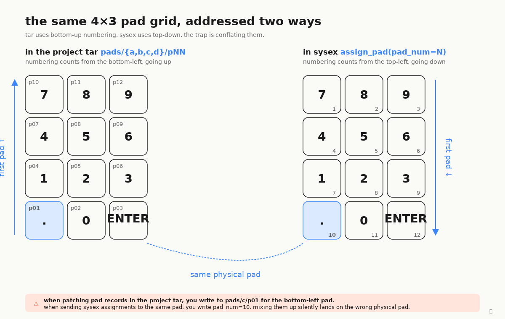

# Pad numbering: the two-conventions trap

The EP-133 has 12 pads in a 4×3 grid. They get **numbered two different
ways** depending on what API surface you're on:

- **TAR `pNN`** (filenames inside a project archive — `pads/c/p01..p12`)
  counts **bottom-up, left-right**. `p01` is the bottom-left pad
  (label "."). `p12` is the top-right pad (label "9").
- **SysEx `pad_num`** (the integer you pass to `assign_pad`,
  `FILE_METADATA_SET` on pad fileIds, etc.) counts **top-down,
  left-right**. `pad_num=1` is the top-left pad (label "7").
  `pad_num=12` is the bottom-right pad (label "ENTER").

So the same physical pad has two different numbers depending on context.
The bottom-left "." is `p01` in the TAR but `pad_num=10` over SysEx.

This catches everyone who works in both layers. If you're patching a
project TAR, address pads via `pNN` (bottom-up). If you're talking
SysEx, address them via `pad_num` (top-down). Don't conflate.

For a complete translation table, see [PROTOCOL.md §3.1](../../PROTOCOL.md#31-pad-numbering--two-different-conventions).
