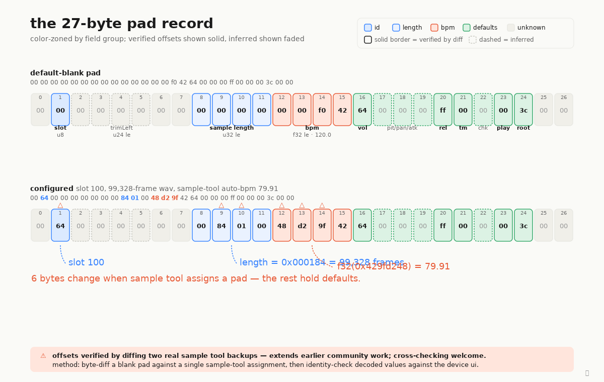

# Pad binary record byte-map

Each pad in an EP-133 K.O. II project carries two layers of state: a JSON
metadata blob (12 fields, easy to read) and a 26-byte binary record that
holds the timing-critical values the firmware actually consumes at
playback. This diagram lays out that binary record byte-by-byte, with
the field groups color-zoned: **id** (the slot pointer), **length**
(sample length in frames), **bpm** (the float32 that drives time-stretch),
**defaults** (volume / envelope / playmode / root note), and **unknown**
(bytes we have not yet identified).

Note: Sample Tool round-trips pad records as 27 bytes (with a trailing
`0x00`), and earlier versions of this document followed suit. The
factory-native size is 26 bytes — the 27-byte form is non-canonical and
corrupts scene-switch iteration on the device, surfacing as
`ERR PATTERN 189` at runtime. See
[PROTOCOL.md §7.0 erratum](../../PROTOCOL.md#70-erratum-2026-04-29-pad-records-are-26-bytes-not-27)
for the full write-up.

The two strips show the same record in two states. The top strip is a
default-blank pad pulled verbatim from a Sample Tool backup (truncated
to 26 bytes). The bottom strip is the same pad after Sample Tool
assigns a 99,328-frame WAV at auto-detected 79.91 BPM. Diffing them
surfaces the offsets directly: exactly six bytes change — one in the
slot field, three in the sample-length u32 LE, and three in the BPM
float32 LE. Solid borders mark offsets verified by this diff plus
identity checks against the device UI; dashed borders mark fields
we've inherited by name from prior community RE work and not yet
independently verified here.

The diff above places several offsets a few bytes apart from earlier
published tables (notably phones24's archive parser). More captures
across more devices and firmware versions would help reconcile;
[PROTOCOL.md §7](../../PROTOCOL.md#7-pad-binary-record-26-bytes-in-project-tar--see-70-erratum)
documents the verification status field-by-field, and
[the diff procedure](../verifying-byte-offsets.md) is fully reproducible
if you'd like to run your own checks.
