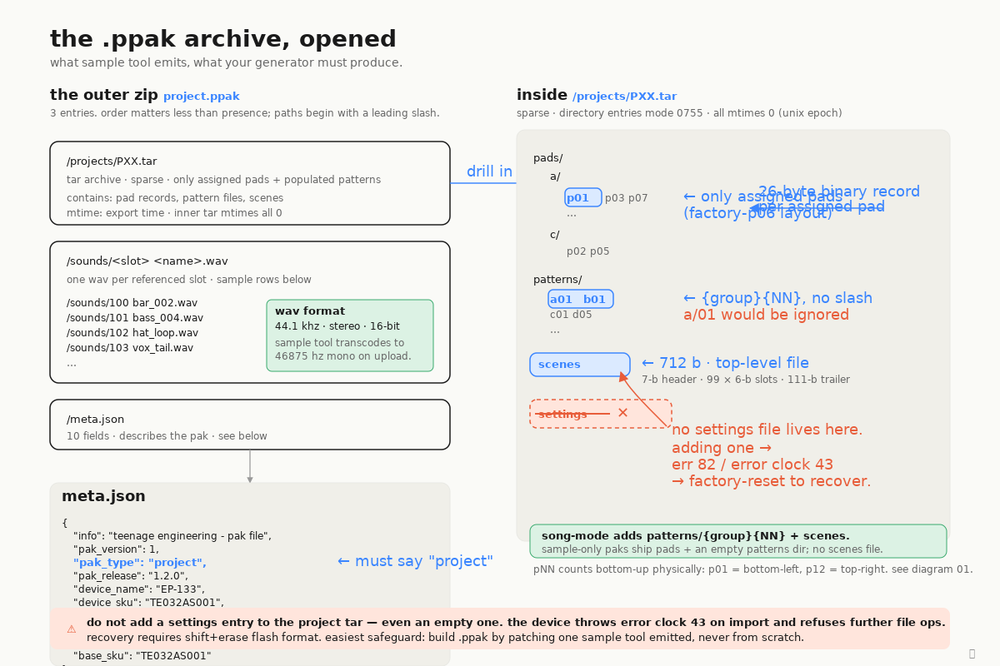

# The .ppak archive format

A `.ppak` is a plain ZIP archive with three entries: `/projects/PXX.tar`,
one or more `/sounds/<slot> <name>.wav` files (44.1 kHz stereo, 16-bit —
Sample Tool transcodes to 46875 Hz mono on upload), and a 10-field
`/meta.json` describing the pak. The project TAR inside contains 54
entries: a `pads/` tree with banks `a/b/c/d`, each holding 12 binary
pad records (`p01..p12`, 27 bytes each), plus an empty `patterns/`
directory. ZIP entry mtimes reflect export time; TAR entry mtimes are
all 0 (Unix epoch) — Sample Tool emits it that way and the device
relies on it.

The unmissable trap: **there is no `settings` file inside the project
TAR**, and adding one — even an empty one — is fatal. The device
imports the project, fails an internal check, and throws **ERROR CLOCK
43**. Once that fires, the file session is wedged; the only known
recovery is a `SHIFT+ERASE` flash format, which wipes the device. See
[PROTOCOL.md §9](../../PROTOCOL.md#9-error-clock-43--the-settings-file-trap)
for the full failure mode and observed device state.

The safest generator strategy is **patch-from-real**: take a `.ppak`
that Sample Tool actually emitted, swap the WAV payloads and patch
the pad records you need to change, and re-zip. This sidesteps almost
every format pitfall — you inherit the correct entry order, the epoch
mtimes inside the TAR, the directory mode bits, the pNN ordering, and
(critically) the absence of a `settings` entry. Building a `.ppak` from
scratch is possible but requires byte-for-byte discipline, and the
device offers no useful diagnostics when something's off — which is
why this repo's writer leans on the patch-from-real path.
