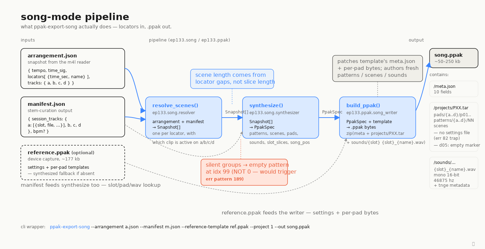

# The song-mode export pipeline

`ppak-export-song` glues three stages together to turn an Ableton arrangement snapshot into a `.ppak` the EP-133 will boot in song mode. `resolve_scenes()` walks the locators in the arrangement, and for each one picks which clip is active on tracks A/B/C/D — emitting a `Snapshot` per locator. `synthesize()` then turns that list into a `PpakSpec`: deduped patterns keyed by `(group, pad, bars)`, one `PadSpec` per used pad, one `SceneSpec` per snapshot, and a `slot_slices` map carrying each clip's start/end offsets. Finally `build_ppak()` patches a reference `.ppak` template's `meta.json` and per-pad byte templates while authoring the patterns, scenes, and sound entries from scratch — then zips the lot.

Each stage owns a clear slice of the work. The resolver only knows about time and clip selection; the synthesizer encodes EP-133 limits (99 scenes, 99 patterns/group, 12 pads/group, slot 700+ for song-export) and the empty-pattern bookkeeping; the writer is the only stage that touches bytes. The reference template is optional — without one, a synthetic zero-filled template is generated on the fly, enough to boot the device.

A few invariants make song mode work and are easy to get wrong. Scene length is taken from quantized locator gaps, not from any clip's slice length — without this a 4-bar Ableton section truncates to a 2-bar slice on the device. Silent groups never reference pattern index 0; they reference an empty marker pattern allocated from index 99 down, sized to that scene's bars (a 0 in a scene chunk hard-faults `err pattern 189`). And every export gets a `song_positions` list (default: scenes 1..N in order) so the device sees song mode as configured.

See also [`05_scenes_anatomy.svg`](05_scenes_anatomy.svg) and [`06_pattern_anatomy.svg`](06_pattern_anatomy.svg) for byte-level views of what the writer emits into the inner TAR.
