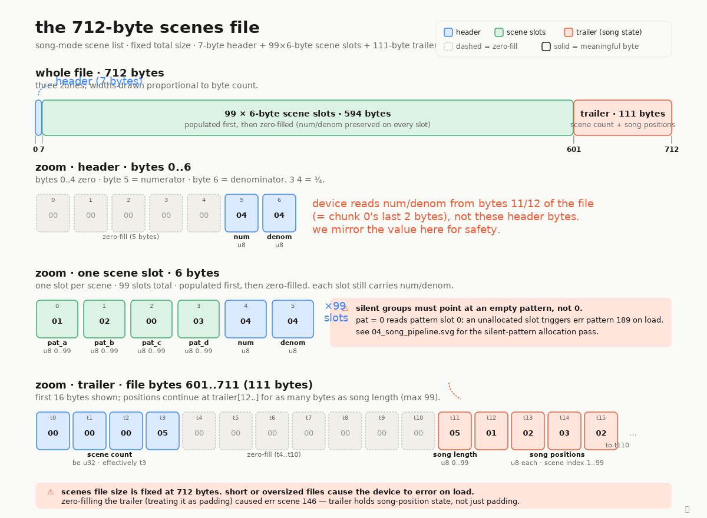

# the 712-byte scenes file

the `scenes` file inside an ep-133 project tar is the song-mode "scene
list": which patterns play in which scene (one bank-row per scene, four
pattern slots `pat_a..pat_d`), the project-wide time signature, and the
song-mode position playlist that the device steps through when you hit
play in song mode. total size is fixed at 712 bytes regardless of how
many scenes are populated — the device rejects any other size on load.

the layout is three zones. a 7-byte header carries the time-signature
numerator/denominator at offsets 5/6 (the rest is zero). then 99 ×
6-byte scene slots (594 bytes), populated slots first and the remainder
zero-filled — but every slot still carries num/denom in its last two
bytes, because the device actually reads time-signature from bytes
11/12 of the file (= chunk 0's last two bytes), not from the header.
finally a 111-byte trailer that is *not* padding: trailer bytes 0..3
hold scene count as a big-endian uint32 (effectively a single byte at
trailer[3] since count < 256), trailer[11] is the song-position count,
and trailer[12..] is one byte per song position holding a scene index
1..99. zero-filling the trailer caused `err scene 146` on load — the
device reads past the populated chunks looking for that count and the
position list.

two adjacent footguns to keep in mind: silent-group entries must point
at an actual empty pattern (not pattern 0), or the device throws
`err pattern 189` on load; and a song-position byte of 0 means "no
scene" — valid indices are 1..99, mirroring the device's 1-based scene
numbering.

source: `ep133/song/format.py:build_scenes`.
