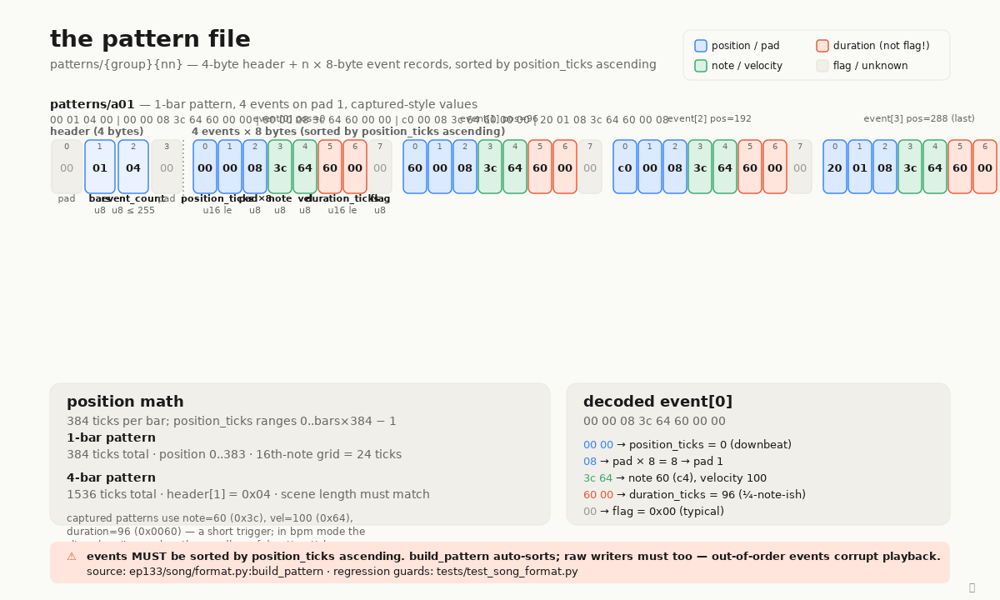

# Pattern file byte-map

A pattern file (`patterns/{group}{nn}` inside the project tar) is one
looping sequence of pad triggers — bass on pad 1, kick on pad 2, etc.
There is one file per pattern, and scenes reference patterns by group
+ index. The format is refreshingly small: a 4-byte header followed
by a tightly packed array of 8-byte event records, sorted by
`position_ticks` ascending. 384 ticks per bar; a 1-bar pattern spans
positions 0..383, a 4-bar pattern spans 0..1535.

Two regression-test gotchas earn the warn-color callouts in the
diagram. First, `header[1]` is `bars` as a uint8, **not** a constant
`0x01` — it must equal the scene's bar length, or playback skews
mid-song. An early port hard-coded `0x01` and quietly broke
multi-bar patterns until the byte-diff caught it. Second, bytes 5..6
of each event are `duration_ticks` as little-endian uint16 — they are
**not** "flag bytes" the way an upstream port (danny desert's
`ppak.py`) labelled them. The captured value is `0x0060 = 96`, a
short trigger; in bpm mode the slice plays its own sample length
regardless. The genuine flag byte is byte 7, mostly `0x00`, with
`0x08` observed on last events in some captures (meaning unconfirmed).

The other byte worth flagging is the pad indicator at event byte 2:
file paths use 1-indexed pads (`pads/{group}/p10`), but the event
encodes `(pad − 1) × 8`, so pad 1 → `0x08`, pad 12 → `0x58`. The
verified reference for all of this is
[`ep133/song/format.py:build_pattern`](../../ep133/song/format.py),
with regression guards in
[`tests/test_song_format.py`](../../tests/test_song_format.py).
