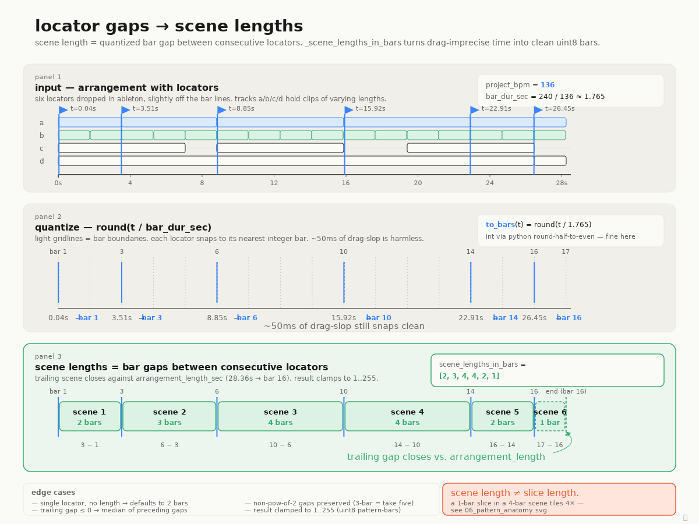

# From locator gaps to scene lengths

In song mode the EP-133 needs each scene's length expressed as an integer number of bars (uint8, 1..255). The arrangement coming out of Ableton has none of that — it has locators dropped onto a continuous timeline at whatever times the user happened to release the mouse. The bridge is the obvious-once-you-see-it idea that **each locator marks the *start* of a scene, and the *gap* between consecutive locators is that scene's length**. Slice (clip) length is independent — a 1-bar B-slice tiles 4× across a 4-bar scene; the synthesizer doesn't conflate the two.

Locators don't always land cleanly on bar boundaries — drag a locator at 136 BPM and you'll often land within a few tens of milliseconds of the bar line. Computing fractional bar gaps directly would yield jittery, slightly-off integer counts after rounding. Instead `_scene_lengths_in_bars` quantizes each locator first: `bar_i = round(locator_time_sec / bar_dur_sec)` where `bar_dur_sec = 240 / project_bpm`. Once locators live in integer-bar coordinates the gaps are subtraction. ~50ms of human imprecision is absorbed silently. The trailing scene closes against `arrangement_length_sec` (also quantized); without one, it falls back to the median of preceding gaps, and a single-locator arrangement defaults to 2 bars.

Two things worth flagging. First, non-power-of-2 gaps survive on purpose. A 3-bar section is a real musical thing (Take Five, `7/4` blues turnarounds, half-bar interludes paired up), so the synthesizer will not silently round 3 to 4. A future "musical conformity" mode could opt-in to that snap, but the default preserves intent. Second, the trailing-gap rescue path matters: a 0- or negative-bar tail (which happens when `arrangement_length_sec` rounds onto the last locator's bar) gets replaced by the median of prior gaps, never by 0 — a 0-bar scene would smuggle a forbidden zero into pattern bytes downstream.

Source of truth: `ep133/song/synthesizer.py::_scene_lengths_in_bars` (lines 178–233). Behavior is pinned by `tests/test_song_synthesizer.py::test_scene_lengths_*`, including the 136 BPM uneven-locator example shown in the diagram.
