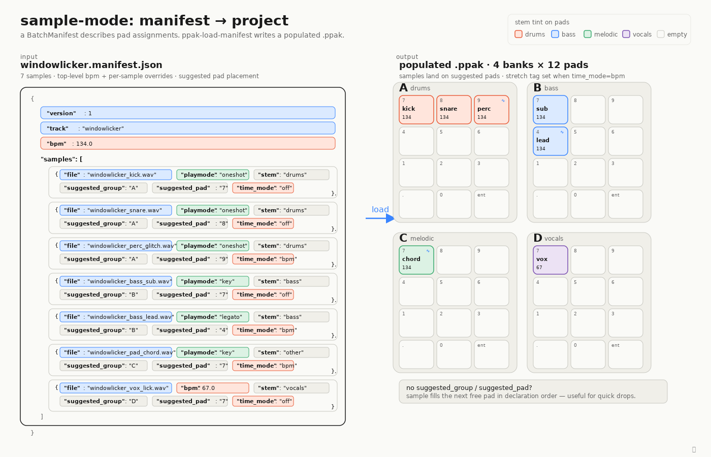

# Sample-mode: manifest → project

A `BatchManifest` is a flat list of samples plus a few project-wide defaults
(`track`, `bpm`). Each entry says which WAV goes on which pad and how the
device should treat it: `playmode`, `time_mode`, `stem`, `suggested_group` /
`suggested_pad`. `ppak-load-manifest` reads the manifest and writes a populated
`.ppak` — the right side of the diagram is the device state you'd see after
loading. Empty pads stay empty; samples without `suggested_*` fall through to
the next free slot in declaration order. Track-level `bpm` is the default;
per-sample `bpm` overrides it (the `vox` pad on group D shows this). The wave
tilde on a pad means `time_mode: bpm` was set, so the device stretches the
sample to project tempo on playback.

See [`MANIFEST.md`](../MANIFEST.md) for the full schema reference and
[`LOADING_SAMPLES.md`](../LOADING_SAMPLES.md) for the prose walk-through of
loading flows.
