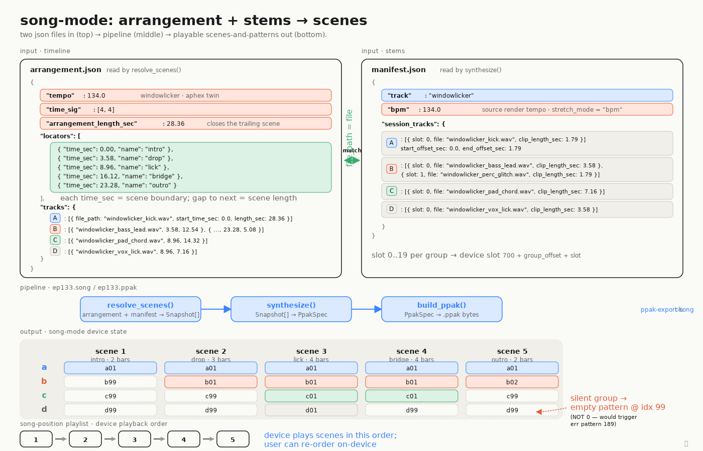

# Song-mode: arrangement + stems → scenes

An `arrangement.json` defines a timeline — tempo, time signature, locators that
mark scene boundaries, and per-group clips on tracks A/B/C/D. A `manifest.json`
says where the actual stem WAVs live and which slot each one occupies inside its
group's 0..19 window. The two files match on the `file_path` ↔ `file` invariant
(green arrow); the resolver fails clearly if a clip points at a stem the manifest
doesn't register.

`ppak-export-song` glues the pipeline together: `resolve_scenes()` walks each
locator and figures out which clip is active per group, `synthesize()` turns
that into patterns/scenes/pads/song-positions, and `build_ppak()` emits the
final `.ppak` bytes. Silent groups in a scene point at the per-group empty
pattern at index 99 — never index 0, which would crash the device with `err
pattern 189`.

See [`MANIFEST.md`](../MANIFEST.md) for the full schema reference,
[`04_song_pipeline.svg`](04_song_pipeline.svg) for the pipeline call-graph, and
[`07_locator_to_scene.svg`](07_locator_to_scene.svg) for how locator times
quantize to bar-counted scene lengths.
